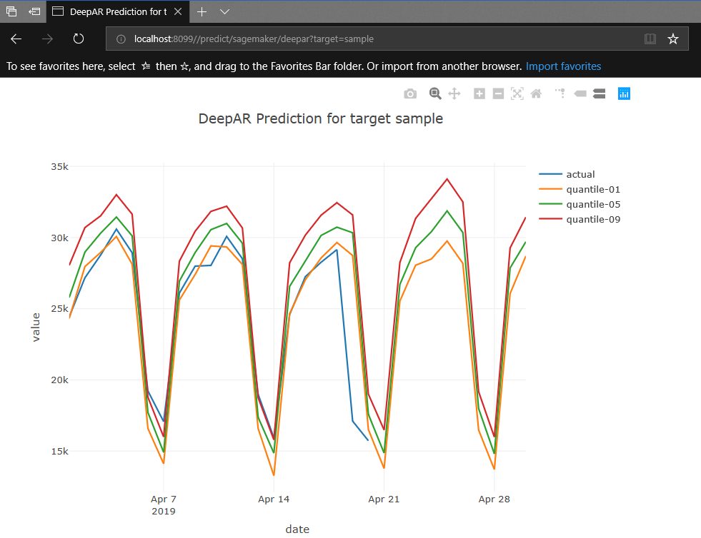

# Spring Boot Template for Amazon SageMaker DeepAR Endpoint Integration
This template application was built with Java Spring Boot framework with the aim to help machine learning engineer quickly setup an working code baseline for DeepAR endpoint testing/integration.



## Highlights
* Implemented as a Spring Boot Web Application(running on port **8099**, feel free to customize), service is invoked at *http://localhost:8099/predict/sagemaker/deepar?target=<target_name>*, see explanation below
* DeepAR request/response jsonization - Build your DeepAR request using provided json classes
* AWS4 signing implementation - All the lengthy and error-prone work is done for you!
* Input file template with categories
* Response data visualization in browser using **JTablasaw** - a Java dataframe and visualization library, see [JTablasaw on Github](https://github.com/jtablesaw/tablesaw)

## Requirements
Basic understanding about
* Java version >= 8
* AWS and SageMakeer
* AWS SageMaker DeepAR for time series data modeling and prediction
* AWS4 signing process

## How does it work?
1. When the web application receives a GET request at *http://localhost:8099/predict/sagemaker/deepar?target=<target_name>*, the value of parameter *target* is extracted and used to locate the a file containing the time series input data for the model, see following source files for details:
     - [WebController.java](https://github.com/adventure-island/springboot-deepar-template/blob/master/src/main/java/com/tensorlab/ml/WebController.java)
     - [LabManager.java](https://github.com/adventure-island/springboot-deepar-template/blob/master/src/main/java/com/tensorlab/ml/LabManager.java)
2. The input file is loaded and transformed into a json object, which will be used and the DeepAR POST request payload, see [com.tensorloab.ml.aws.sagemaker.deepar.json](https://github.com/adventure-island/springboot-deepar-template/blob/master/src/main/java/com/tensorlab/ml/aws/sagemaker/deepar/json) for details
3. AWS4 authentication headers are built based on your AWS user credential, current UTC request time, SageMaker endpoint specification and the request payload, 
      - see [Examples of the Complete Version 4 Signing Process (Python)](https://docs.aws.amazon.com/general/latest/gr/sigv4-signed-request-examples.html) for the detailed specification of AWS4 signing process and a python implementation
      - check this source folder for my java implementation -  [com.tensorlab.ml.aws.auth](https://github.com/adventure-island/springboot-deepar-template/blob/master/src/main/java/com/tensorlab/ml/aws/auth/)
4. POST request containing the authentication headers and the json playload is sent to the DeepAR endpoint
5. Response from the DeepAR endpoint is received, parsed and stored as csv files
6. Finally the stored csv response file is plotted as a time series graph, and the javascript of the graph is sent back as the final response, see [PlotUtil.java](https://github.com/adventure-island/springboot-deepar-template/blob/master/src/main/java/com/tensorlab/ml/PlotUtil.java) for details

### Application Configuration
- Define your AWS IAM access key and secret as environment variable **AWS_SAGEMAKER_USER_ACCESS_KEY** and **AWS_SAGEMAKER_USER_ACCESS_KEY**, respectively
- In **src/main/resource/application.yml** (Note that you can also create your own application.yml in application directory to
overwrite the default values)
     * specify your SageMaker service region and host, visit this link to find out the region and endpoint that suit your requirement: [AWS Regions and Endpoints](https://docs.aws.amazon.com/general/latest/gr/rande.html#sagemaker_region)
     * specify the endpoint name of your deployed model, this is the name you used to deploy the your model endpoint

### Input File
An sample input file [prediction-input-sample.csv](https://github.com/adventure-island/springboot-deepar-template/blob/master/src/main/resources/prediction-input-sample.csv) is provided in folder src/main/resources, the name of the input file 
must use format *prediction-input-<target>.csv*, where the value of **target** will be used as the value of the request 
parameter **target**. For example, if your input file is **prediction-input-temperature.csv**, then when you make the prediction request, the request URL will be **http://localhost:8099/predict/sagemaker/deepar?target=temperature**, when the request is received by your Spring Boot application, the value of request parameter **target** in the request URL will be used to locate the input file
### Input File Sample
```csv
datetime,category0,category1
2013-08-01,41,1
2013-08-02,34,1
2013-08-03,10,1
2013-08-04,24,1    
```
     
### Tips
* Current input data needs to have 2 categories, use [jsonschema2pojo](http://www.jsonschema2pojo.org/) to regenerate DeepAR json request and response classes according to your actual requirement
* Directly test your deployed endpoint using SageMaker API with your AWS notebook to make sure the model inference works in the first place
* Use [Postman](https://www.getpostman.com/) to test your IAM user access key and secret
* Interested in code basedline that can help you quickly setup a local RNN training envrionment? - See [tensorlab](https://github.com/adventure-island/tensorlab) - A deep learning tool which helps data scientist and deep learning engineer quickly and efficiently setup experiment for time series data modelling and prediction, using Keras(with Tensorflow backend)


